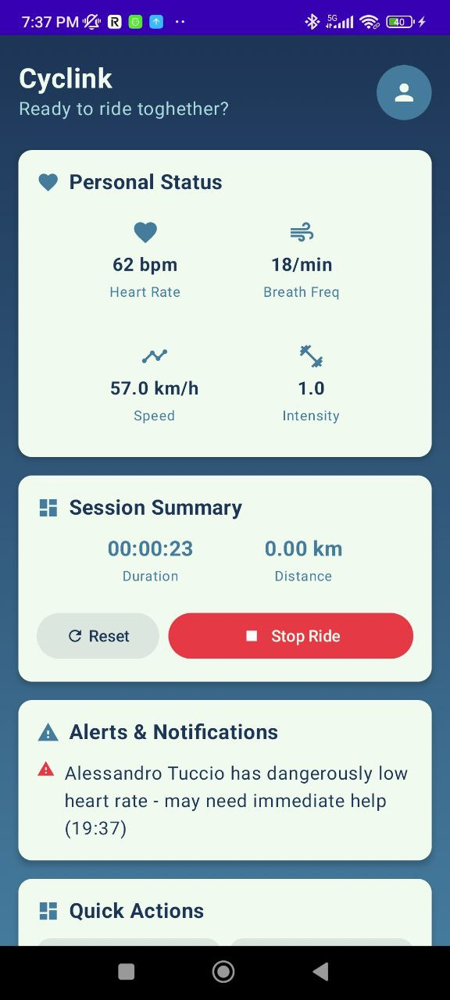
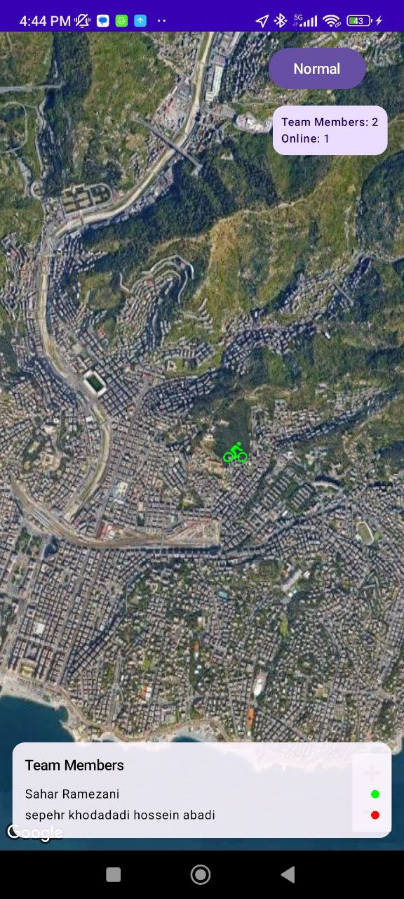
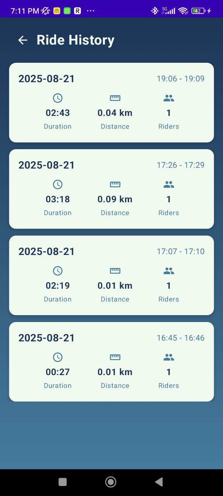
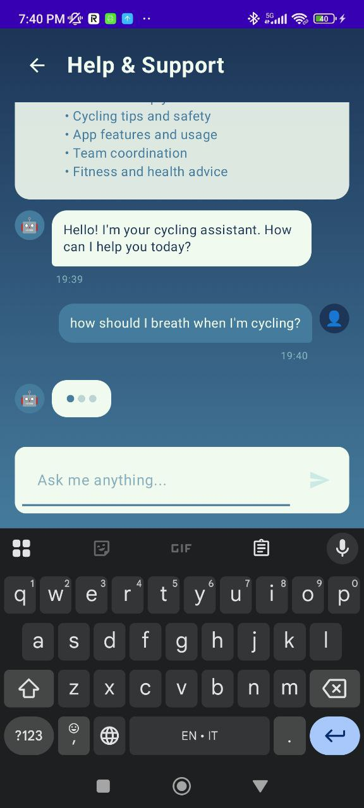
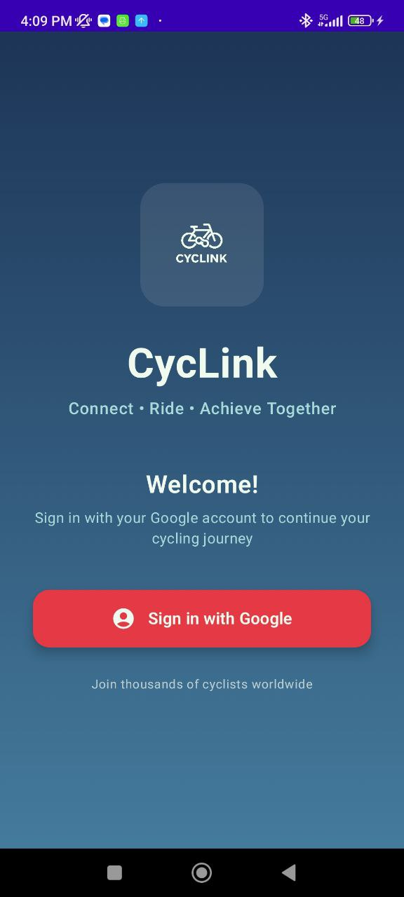
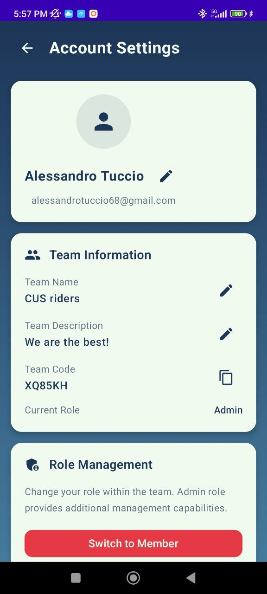

# Cyclink App - Concise README

Cyclink is a mobile application designed for cyclists, offering a range of features to enhance their riding experience, facilitate team collaboration, and track their activities.

## Features

### Team Management

Cyclink allows users to create and join teams, manage team members, and view team-related activities. This includes:

*   **Team Overview:** See a ranking of team members based on their cycling statistics.

    

*   **Member Tracking:** View individual member details and their locations on a map.

    

### Activity Tracking & History

Track your cycling activities and review your performance over time.

*   **Ride History:** Records of past rides.

    

*   **GPS Integration:** Utilize GPS to record routes and provide accurate location data.

### Communication & AI Assistance

*   **Help Chat:** Get real-time help using AI-powered chat.

    

### User Authentication & Profile

*   **Google Sign-In:** Secure and convenient authentication using Google accounts.

    

*   **User Profile:** Manage personal account information.

    

## Setup and Configuration

To run the Cyclink app, the following configuration files and API credentials are required:

*   **`google-services.json`**: This file is essential for connecting your Android application to Firebase services, including Firebase Authentication and Firestore. It should be placed in the `app/` directory of your project.

*   **API Credentials**:
    *   **Google Gemini API Key**: Required for the AI Helper functionality within the chat feature.
    *   **Google Maps API Key**: Necessary for displaying maps and tracking locations in features like member tracking and ride history.
    *   **Web Client ID for Authentication**: Used for Google Sign-In to authenticate users.

Ensure these are correctly configured in your project for all features to function as intended.